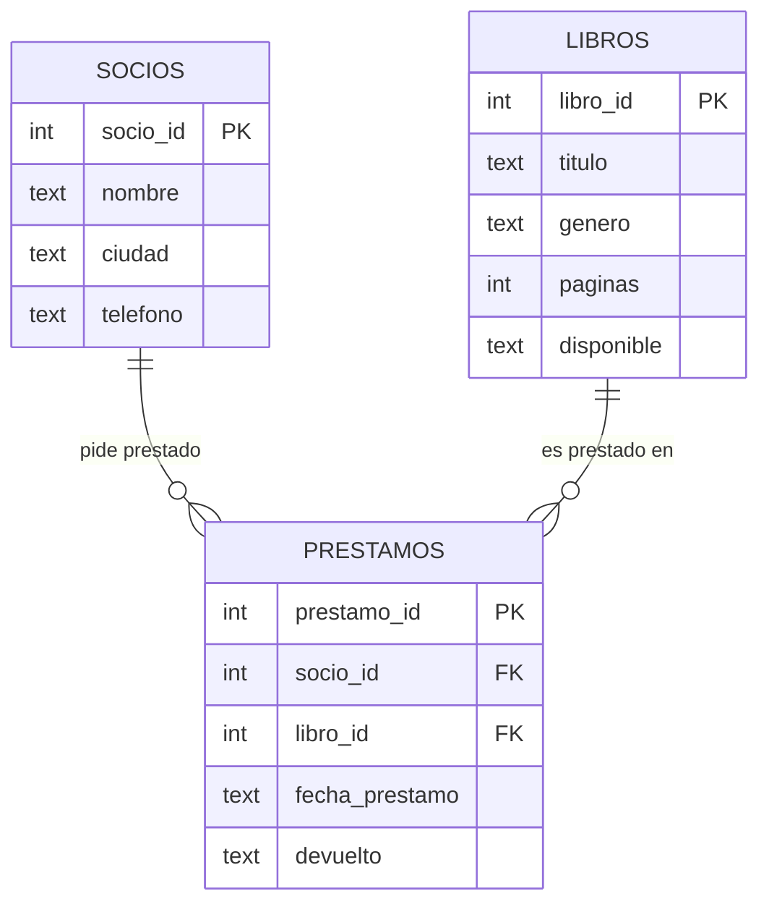

# 👀 Ver y entender la base de datos en VS Code (sin la plataforma)

> Esta guía enseña a **mirar la base de datos por dentro** directamente en Visual
> Studio Code, con extensiones y sentencias SQL — sin usar la plataforma web.
> El objetivo no es escribir consultas todavía, sino **entender qué hay dentro**:
> las tablas, las columnas y, sobre todo, **las relaciones**.
>
> Va justo después del **Paso 0** del [README](README.md) (cuando ya has ejecutado
> `scripts/00_reset_biblioteca_nivel0.sql` y la base de datos existe).

---

## 1. ¿Dónde está la base de datos?

En SQLite, **la base de datos es un único archivo**: `biblioteca_nivel0.db`.

No la ves hasta que la creas. Se crea sola cuando ejecutas el script inicial:

```
scripts/00_reset_biblioteca_nivel0.sql
```

Ese script hace tres cosas: borra las tablas viejas, **crea** las tablas
(`socios`, `libros`, `prestamos`) e **inserta** los datos de ejemplo. Cuando
termina, el archivo `biblioteca_nivel0.db` aparece en la carpeta del curso. **Eso
es tu base de datos.** Puedes copiarla, moverla o borrarla como cualquier archivo.

> Si borras el `.db`, no pasa nada: vuelves a ejecutar el script y la tienes otra
> vez. Esa libertad para equivocarte es la gran ventaja de SQLite.

---

## 2. Las extensiones que necesitas

Con dos extensiones tienes el laboratorio completo dentro de VS Code:

| Extensión | ID | Para qué sirve |
|---|---|---|
| **SQLite Viewer** | `qwtel.sqlite-viewer` | **Mirar**: abrir el `.db` y ver las tablas y filas como una hoja de cálculo |
| **SQLite** | `alexcvzz.vscode-sqlite` | **Preguntar**: ejecutar sentencias SQL sobre el `.db` y ver resultados |

> **Opcional, para ver el diagrama de relaciones:** la extensión
> **Database Client** (`cweijan.vscode-database-client2`) conecta con el `.db` y
> **dibuja el diagrama ER** (las tablas con líneas entre ellas). No es necesaria
> para esta guía, pero es la forma más visual de "ver" las relaciones.

---

## 3. Mirar la base de datos por fuera (SQLite Viewer)

La forma más directa de **ver** lo que hay:

1. En el explorador de archivos de VS Code, busca `biblioteca_nivel0.db`.
2. Haz **doble clic** sobre él.
3. Se abre SQLite Viewer y verás las tres tablas: `socios`, `libros`, `prestamos`.
4. Pincha en cada una y observa sus filas, como en una tabla de Excel.

Fíjate en `prestamos`: verás columnas como `socio_id` y `libro_id` que contienen
**números**, no nombres. Esos números son la clave de todo (lo vemos en el punto 5).

---

## 4. Mirar la ESTRUCTURA con SQL (qué tablas y columnas hay)

Mirar las filas está bien, pero para *entender* la base de datos necesitas ver su
**estructura**. Esto se hace con sentencias especiales. Ábrelo con la extensión
SQLite (`Ctrl+Shift+P` → `SQLite: Run Query` → elige `biblioteca_nivel0.db`) o
usa el script [`scripts/00b_ver_y_entender_la_bbdd.sql`](scripts/00b_ver_y_entender_la_bbdd.sql).

```sql
-- ¿Qué tablas tiene esta base de datos?
SELECT name FROM sqlite_master WHERE type = 'table';

-- ¿Qué columnas tiene la tabla prestamos? (nombre, tipo, si admite NULL, PK)
PRAGMA table_info(prestamos);
```

`PRAGMA table_info(...)` es como pedirle a la tabla que te enseñe su "ficha
técnica": cómo se llama cada columna, de qué tipo es y cuál es la clave primaria.

---

## 5. Entender las RELACIONES (la parte importante)

Esta base de datos tiene **tres tablas, pero no están sueltas**: están conectadas.



Léelo así, en lenguaje normal:

- Un **socio** puede pedir **muchos** préstamos. → relación **1 a muchos** (1:N).
- Un **libro** puede aparecer en **muchos** préstamos. → relación **1 a muchos** (1:N).
- La tabla **`prestamos` es el puente**: cada fila une **un socio** con **un libro**
  en una fecha. Por eso `prestamos` tiene `socio_id` y `libro_id`.

### La clave foránea, sin misterio

Una **clave foránea (FOREIGN KEY)** no es magia. Es **una columna que guarda el
id de una fila de otra tabla**. En `prestamos`, la columna `socio_id = 1` significa
literalmente: *"este préstamo es del socio cuya fila tiene `socio_id = 1`"*.

Puedes ver esas conexiones declaradas con SQL:

```sql
-- ¿A qué tablas apunta prestamos?
PRAGMA foreign_key_list(prestamos);
```

Verás que `socio_id` apunta a `socios` y `libro_id` apunta a `libros`. Eso son las
dos líneas del diagrama de arriba, escritas de verdad en la base de datos.

### "Ver" la relación funcionando

Los ids sueltos no dicen mucho. Un `JOIN` **sigue esas líneas** y convierte los
números en información de verdad:

```sql
SELECT p.prestamo_id, s.nombre AS socio, l.titulo AS libro, p.devuelto
FROM prestamos p
JOIN socios s ON p.socio_id = s.socio_id
JOIN libros l ON p.libro_id = l.libro_id;
```

Antes veías `socio_id = 1, libro_id = 2`. Ahora ves `Ana Ruiz — SQL para
principiantes`. **Eso es para lo que sirven las relaciones.**

---

## 6. La mejor forma de entenderlo: rómpelo a propósito

Aquí está el ejercicio que hace que todo encaje. Vas a **intentar romper** la base
de datos para ver qué te lo impide y entender *por qué* existen las reglas.

> ⚠️ **Importante en SQLite:** la protección de claves foráneas hay que
> **activarla en cada conexión** con `PRAGMA foreign_keys = ON;`. Si lanzas el
> `INSERT` sin esa línea delante (en la misma ejecución), SQLite **no** dará error
> y se colará un dato roto. Por eso, ejecuta el bloque **completo** de golpe.

### Experimento A — meter un préstamo de un socio que no existe

```sql
PRAGMA foreign_keys = ON;
INSERT INTO prestamos (prestamo_id, socio_id, libro_id, fecha_prestamo, devuelto)
VALUES (99, 999, 1, '2026-03-01', 'NO');   -- socio_id 999 NO existe
```

Resultado esperado: **`FOREIGN KEY constraint failed`**. La base de datos te
**protege**: no deja registrar un préstamo de un socio fantasma. Esa es la
integridad referencial, *sentida* en vez de memorizada.

### Experimento B — meter un valor que no está permitido

```sql
INSERT INTO libros (libro_id, titulo, genero, paginas, disponible)
VALUES (99, 'Libro raro', 'Misterio', 100, 'QUIZA');   -- disponible solo admite 'SI' o 'NO'
```

Resultado esperado: **`CHECK constraint failed`**. La regla `CHECK` impide guardar
un valor que no tiene sentido. Otra forma de protección.

> Estos dos errores **son el objetivo**, no un fallo tuyo. Cuando entiendes qué
> los provoca, entiendes para qué sirven las claves y las restricciones.

---

## 7. Ver lo que NO está relacionado (huecos)

No todo está conectado, y eso también se ve:

```sql
-- Socios que NO han pedido ningún préstamo (LEFT JOIN deja ver los "huecos")
SELECT s.nombre
FROM socios s
LEFT JOIN prestamos p ON s.socio_id = p.socio_id
WHERE p.prestamo_id IS NULL;

-- Libros que nunca se han prestado
SELECT l.titulo
FROM libros l
LEFT JOIN prestamos p ON l.libro_id = p.libro_id
WHERE p.prestamo_id IS NULL;
```

Un `JOIN` normal solo muestra lo que coincide; un `LEFT JOIN` muestra **también lo
que se queda solo**. Es la forma de detectar al socio que no pide libros o al libro
que nadie lee.

---

## 8. Mini-retos (compruébate)

Sin mirar soluciones, intenta:

1. Ver todas las tablas de la base de datos con una sentencia.
2. Ver las columnas de la tabla `socios`.
3. Decir, mirando el diagrama, cuántas relaciones 1:N hay y entre qué tablas.
4. Escribir un `JOIN` que muestre el **nombre del socio** y el **título del libro**
   de cada préstamo NO devuelto.
5. Provocar un error de clave foránea a propósito y explicar con tus palabras por
   qué la base de datos lo impide.

Soluciones y comandos paso a paso en
[`scripts/00b_ver_y_entender_la_bbdd.sql`](scripts/00b_ver_y_entender_la_bbdd.sql)
y [`soluciones/00b_ver_y_entender_la_bbdd_resuelta.sql`](soluciones/00b_ver_y_entender_la_bbdd_resuelta.sql).

---

## 9. Errores típicos (y arreglo rápido)

| Síntoma | Causa | Arreglo |
|---|---|---|
| `no such table: socios` | No has creado la base de datos | Ejecuta `scripts/00_reset_biblioteca_nivel0.sql` |
| El `INSERT` malo **no** da error de FK | Las claves foráneas estaban desactivadas | Pon `PRAGMA foreign_keys = ON;` en la misma ejecución |
| No encuentro el `.db` | Aún no lo has creado o está en otra carpeta | Ejecuta el script inicial; busca `biblioteca_nivel0.db` |
| SQLite Viewer no abre el `.db` | Extensión no instalada | Instala `qwtel.sqlite-viewer` |
| Cambié datos y no se actualiza la vista | La vista del Viewer está cacheada | Cierra y vuelve a abrir el `.db` |

---

## 10. Resumen de lo aprendido

- La base de datos es **un archivo** (`.db`) que se crea al ejecutar el script inicial.
- Se **mira** con SQLite Viewer y se **interroga** con la extensión SQLite.
- `PRAGMA table_info(tabla)` muestra la estructura; `PRAGMA foreign_key_list(tabla)`
  muestra las relaciones.
- Una **clave foránea** es solo una columna que guarda el id de otra tabla.
- Un **`JOIN`** sigue esas relaciones y convierte ids en información real.
- **Romper** la base de datos a propósito (FK y CHECK) es la mejor forma de
  entender por qué existen las reglas.

Cuando esto te resulte natural, sigues con el **Paso 1** del [README](README.md):
consultar datos con `SELECT`.
